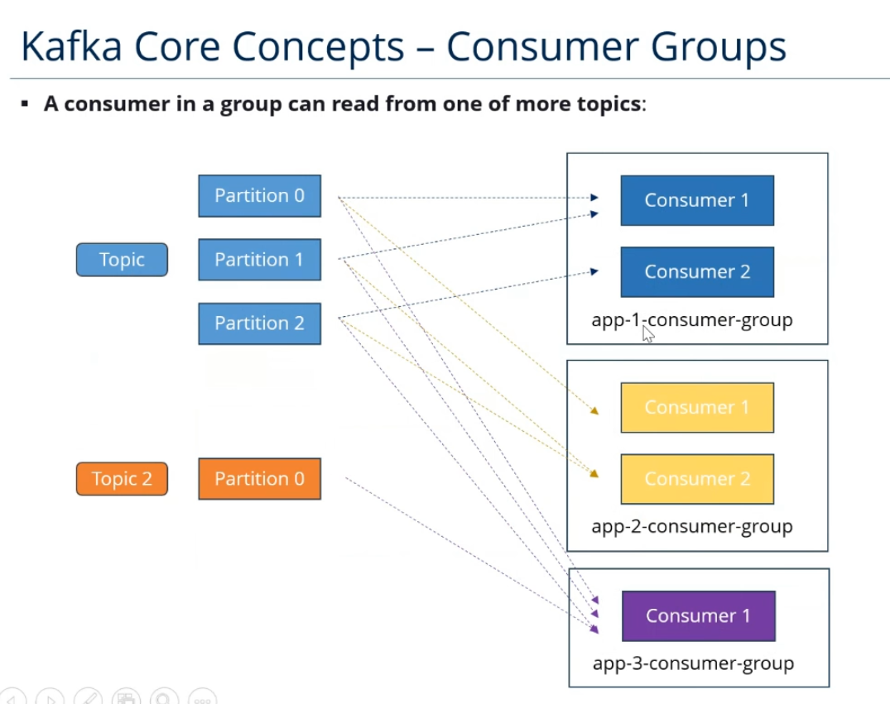

# Kafka Training Notes

 

`__consumer_offset` topic: melyik consumer melyik partíció melyik offsetjénél tart
 
## Topic Replication
 
- One leader and multiple ISR (in-sync replicas)
- Producer csak a leader-be írhat
- Consumer alapból a leaderből olvas, de átállítható
## Producer Acknowledgement Options
 
- **acks = 0**
  - No acknowledgement (does not wait for any ack from the broker)
  - **Use case**: High throughput, low latency, risk of data loss
- **acks = 1**
  - Leader acknowledgement: producer waits for the leader to write the record to its local log
  - **Use case**: Balanced approach, moderate latency, and throughput
- **acks = all / -1**
  - Producer waits for all in-sync replicas for ack
  - **Use case**: Highest reliability, ensures no data loss, but higher latency
## Kafka CLI
 
- Create a new Kafka topic named `test_topic` with a single partition and one replica:
```bash
  kafka-topics.sh --create --topic test_topic --bootstrap-server localhost:9092 --partitions 1 --replication-factor 1
```
 
- List all available Kafka topics:
```bash
  kafka-topics.sh --list --bootstrap-server localhost:9092
```
 
- Get details about the `test_topic`:
```bash
  kafka-topics.sh --describe --topic test_topic --bootstrap-server localhost:9092
```
 
- Delete the `test_topic`:
```bash
  kafka-topics.sh --delete --topic test_topic --bootstrap-server localhost:9092
```
